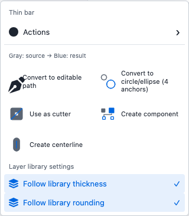
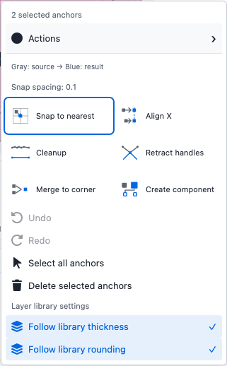
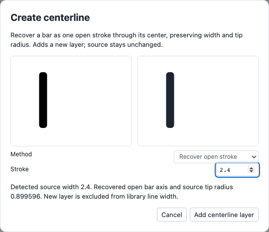
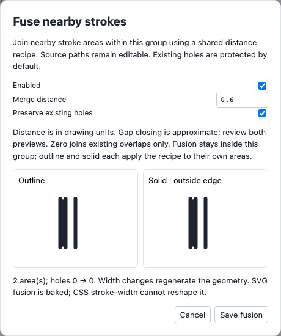

# Shape actions and library exceptions

Right-click a shape on the canvas or in Layers, then open **Actions**, the first command below the selection heading. The same selection-aware commands appear in both places. Original diagrams show the starting geometry in gray and the result in the accent color; labels remain visible. Arrow Right opens Actions; Arrow Left or Escape closes it and returns focus. Undo, selection commands and layer library settings stay in the first menu. Anchor alignment uses the compact labels **Align X** and **Align Y**, automatically chosen from the selection. Snapping and alignment use gray-source/accent-result diagrams, with a fixed icon column and separate wrapping label.

**Create centerline** is available for one visible filled shape or group. Review the source and candidate, then choose **Add centerline layer**. Rounded bars are recognized from their resolved capsule boundaries, even when imported as paths, and recover a single open axis with the original bar width. Other shapes use **Inset contour**, explicitly a boundary-offset candidate rather than an inferred medial axis. Stroke initializes from the detected bar width or a sampled estimate across opposing source boundaries. Nonuniform estimates are labeled for review; when width cannot be estimated safely, set it manually. Inset and stroke can be adjusted; collapsed candidates cannot be applied. Cancel preserves the artwork. Applying adds an independent named stroke layer with symmetry/placement baked once and local width/rounding; source geometry and component links remain unchanged. The new layer is selected immediately, exposing its calculated **layer stroke width** with **exclude from library line width** checked. Library thickness changes leave it unchanged; uncheck that setting or re-enable Follow library thickness to resume inheritance. Hide the original layer to inspect the new layer by itself. Undo removes the candidate; editable exports and reload retain it.

The **Library settings** context section controls the selected object's entire layer. Disable **Follow library thickness** or **Follow library rounding** to capture the current values locally. Re-enable to resume icon/library inheritance. Layer-local widths take priority over icon overrides; icon overrides take priority over library thickness. A diamond indicator marks customized layers and library icons containing overrides. Local width and corner/end rounding can be edited in the layer inspector. Local values apply in canvas, isolation, previews, SVG/raster output and generated solid geometry.

## Dogfood findings

Eight original editable action icons were imported into a disposable ICONERD library and survived reload. Prototype comparisons include light/dark appearance, two-column versus row layouts and keyboard/mobile interaction. Artifacts remain in the ignored `imports/action-language/dogfood-v1/` folder.

Half-width inset collapses a 1.2-unit bar and produces a closed contour for wider bars; that is why rounded-bar recovery is a separate method. Recognition is conservative: axis-aligned capsules with matching boundary samples and area, uniform widths when multiple contours occur. Rotated/irregular bars fall back to manual contour review.

**Fuse nearby strokes** is an explicit group recipe. Right-click a stroke union group on Canvas or in Layers → **Actions → Fuse nearby strokes**. Review the outline and derived solid, adjust **Merge distance**, then save. The default protects existing holes. Zero joins existing overlap; positive distances approximately close nearby gaps. The three-bar trial joins the close pair at .6 and all three at 2.4. Preview before applying; this is geometric gap closing, not a metaball field.

The group retains its original editable paths. Changing thickness regenerates its stroke area, and solid generation applies the same distance recipe to the original centerlines' chosen solid boundaries. Fusion stays inside each enabled group. Union ancestors are required; nested fusion is unavailable. Recipes follow shared components, including scaled instances, and remain dormant on fill/both-painted layers. Hide/disable/Undo and editable JSON/ZIP retain the sources. **Disable proximity fusion** provides recovery if a later Boolean change makes the group incompatible.

Fused SVG regions use the stroke color or token as their fill. Geometry is baked even in runtime SVG: CSS color tokens work, but CSS stroke-width cannot regenerate the shape outside ICONERD. Library/icon/layer thickness edits inside the app regenerate it. Derived solid exports retain the existing review requirements; previewing a recipe does not silently approve a solid variant.

