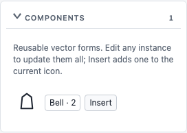

# Components and icon thickness

Right-click a path, anchor's owning path, group, or Layers row and choose **Create component**. Enter a name such as Bell. When the selected path inherits symmetry or an enclosing transform group, creation includes that complete group. Whole-icon symmetry is transferred into the selected layer's component, and that layer opts out of the outer symmetry so it renders once. Other layers retain their symmetry. Existing containing or nested components cannot be wrapped into another component; detach first.

The component retains editable vectors and symmetry. Captured whole-icon symmetry also retains its original evaluation stage: closed source rounding precedes the transferred mirror operation. This preserves rounded half-form silhouettes instead of changing their seam corners merely because they became components. The stage metadata travels through editable JSON / ZIP component definitions.

**Components** is a separate collapsible section, independent of the icon Library. It displays previews and instance counts. Edit selects a source instance; Insert places a linked instance on a new layer in the current icon, with its source placement and no repeated destination symmetry. To build Silence alarms, create Bell, select the destination icon, and click Insert beside Bell. Add or edit the slash/cutter separately. Changing Bell vectors or symmetry in either icon updates every linked instance; placement and instance transforms remain local. Undo/Redo and reload preserve the linkage.

The catalog displays the components currently represented by library instances. Independent component retention after deleting the last instance remains a separate registry-lifecycle improvement.

In **Previews**, enable **Override library thickness for this icon** and enter **Icon thickness**. The saved override takes priority over library thickness, including later token changes. Other library settings still apply. Uncheck it to follow the library again. Override changes support Undo and travel through editable ZIP/JSON and SVG output. The Weight slider previews normally and saves changes when an icon override is active.

Thickness overrides affect editable strokes, not widths baked into filled contours. A barcode can retain filled bars of different widths, or have those bars reconstructed as independently editable stroke geometry; a uniform icon-width override does not turn filled contours into centerlines.

