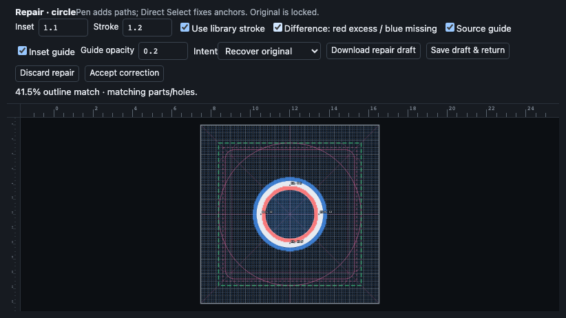

# Guided outline repair and local correction examples

Library → Convert fills to outlines keeps automatic inset conversion as the starting point. Review threshold starts at 95%, is adjustable from 0–100%, and persists in this browser. Changing it only changes which comparison cards need review; topology changes, failed contours, and candidates without paired references still require review. Nothing is automatically published.

Choose **Repair on canvas** on a card. Direct Select edits existing anchors; Pen adds independent strokes, preserving open-path ends instead of implicitly closing them inside a filled compound. Delete a selected contour to replace it, or repair only a few anchors. Original vectors form a locked, non-exporting source guide. Toggle that guide, the dashed inset guide, and a red-excess/blue-missing comparison overlay independently. Guide opacity and inset are adjustable; changing the inset guide does not move authored anchors. The final stroke is centered on the drawn path, so half the width extends outside it.

**Use library stroke** starts enabled. Accepted artwork remains linked to the library thickness token. Uncheck it to use an individual stroke override. Cap/join choices in Previews are retained in repair artwork, editable JSON and SVG export. Repair Undo/Redo is separate from library Undo. **Accept correction** publishes the generated/repaired outline and its correction example in one IndexedDB transaction. Originals and existing library checkpoints remain available; library Undo reverts the accepted publication.

**Save draft & return** preserves one repair draft locally, including draft history, for **Resume repair draft** in review. Starting another repair cannot overwrite it silently. Discard explicitly to start another. Draft storage failure keeps the repair open; Download repair draft exports its JSON for recovery. This export is currently an evidence/recovery artifact, not a supported draft-import format. Resuming verifies that source and target have not changed. Stale drafts can be downloaded before discarding; they are not silently rebased. Browser storage is local to its profile and origin.

Apply outline also captures unchanged automatic candidates as accepted examples, with an Acceptance intent selector. Unspecified and redesign examples are excluded from learned-offset calibration. Accepted examples contain immutable source/initial/accepted vectors, SHA-256 content hashes, generator/build version, inset/stroke/binding/cap/join settings, explicit recovery-vs-redesign intent, before/after overlap/topology metrics, and committed edit/Undo/Redo snapshots. Draft history and edit traces retain the last 100 entries; truncated traces are labeled. View-only pointer movement is not recorded. Choose the correct intent: a new hollow outline design is not necessarily a recovery of a filled source. Cancelled drafts are not accepted examples. Examples affected by Undo, later geometry/token changes or deletion are labeled superseded on export and excluded from suggestions.

**Export correction examples** downloads the records as versioned JSON; no automatic upload exists. **Clear correction examples** removes only those records after an explicit confirmation. Retention is capped at 500 accepted records; export/clear is required before more acceptance. Source packs and exported datasets should remain in ignored imports/ folders, separate from public Git source/deployment.

**Use learned inset** computes a median inset-to-stroke ratio from current accepted recovery examples in the same group, scaled to the candidate's stroke width. It is a small local parameter calibration, not neural-network training or a claim of improved centerline reconstruction. The suggestion changes only the candidate's inset; it requires review. Exported vector examples enable subsequent supervised/imitation experiments; those pipelines and reinforcement training remain future work. Hold out whole component families/library sources when evaluating models, including scaled duplicates.

Validation uses disposable synthetic icons and physical Pen/Direct Select gestures. Source-preservation, rendered stroke width, reload, Undo, atomic geometry/example-write failure, threshold behavior, stale-draft admission, and token/override ownership are exercised in browser tests. Public images contain no imported artwork.

