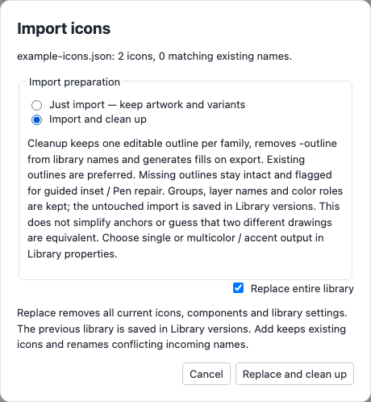

# Import and clean up

Import ZIP / JSON asks whether to **Just import** (the default) or **Import and clean up**. The separate Replace entire library checkbox still controls whether the pack replaces the project or is added with collision names reserved.

Cleanup makes one editable family from an explicit `name` / `name-outline` pair. It prefers the outline artwork, removes `-outline` from internal family names, preserves groups, named layers and color roles, and keeps standalone app-icon artwork separate. It does not simplify anchors or infer that arbitrary similar drawings are equivalent. Independent stroke drawings with conflicting names remain independent.

Existing editable strokes become ready families. A filled `-outline` silhouette is not a centerline: it becomes a pending family. Unpaired fills and baked outlines remain intact, flagged in Problems, and open the inset review automatically. Adjust inset / stroke, Apply outline, or Repair on canvas with Pen / Direct Select, then accept. Acceptance replaces the pending family in place; Undo restores its original fill. A collapsed candidate can be redrawn from a blank repair draft.

The original incoming pack and the preceding library are retained in Library versions. The cleaned replacement and untouched-import checkpoint use one IndexedDB transaction. A storage failure leaves the old project intact. Revert icon retains the import baseline; restoring the Untouched import checkpoint also restores the separate source variants.

Ready families generate fills from their current outline at preview/export time, rather than maintaining a second editable solid. Closed contours use the outside stroke edge and preserve holes; open contours expand the stroke without inventing closure. This is a derived design, not a promise of matching a separately drawn EDS filled variant. Cleanup audits derived fills and flags unsupported or collapsed offsets in Problems while retaining the editable outline. Failed generation also produces an explicit export error. Pending families cannot export generated fills until reviewed. Use Library properties → Output variant to choose outline, generated solid, both, or fill with stroke. EDS outline SVGs use `-outline`; generated filled SVGs use the family name. Editable ZIP JSON remains the single canonical family. Conflicting output filenames produce an error instead of silently overwriting artwork.

Single color uses Fill throughout. Multicolor offers Fill, Stroke and Accent; Accent applies to layers whose color role is Accent. All three can export CSS custom property tokens with fallback colors. Imported layer colors remain available through Keep layer colors. PNG uses fallback colors; macOS menu-bar template output remains black.

Browser correction examples remain local and can be exported separately from reconstruction review. Import cleanup itself does not claim acceptance of an inferred centerline or create training labels for the untouched paired outlines.

