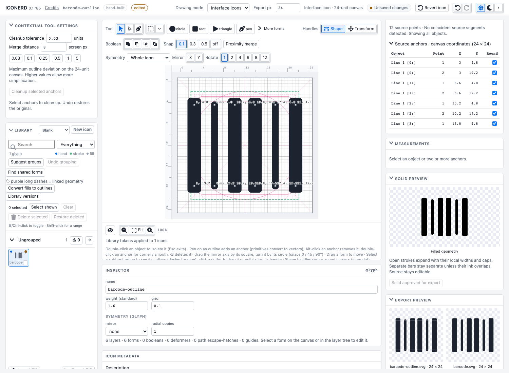
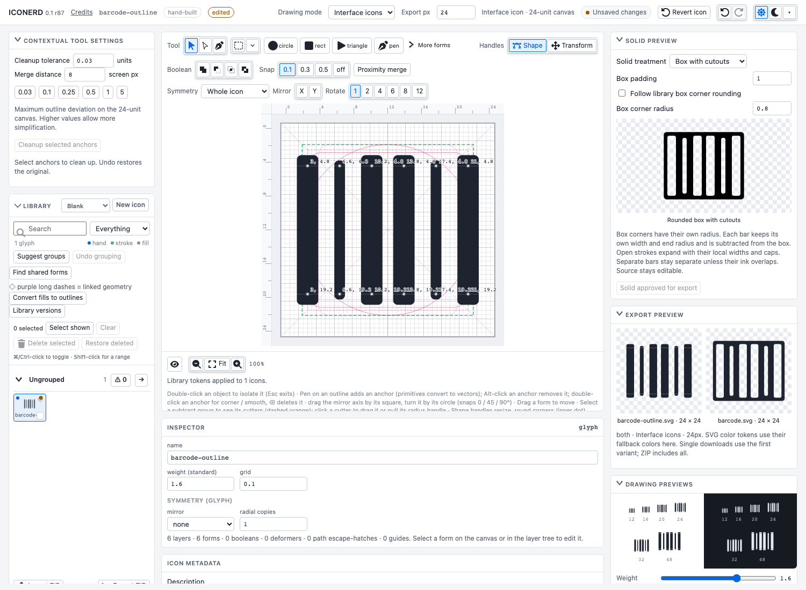

# Library output and solid experiments

Library properties stores output variants, family display, fill/stroke colors and target sizes alongside numeric drawing tokens. These settings persist in the browser, participate in Undo/Redo and travel in editable ZIP archives. Linking or disconnecting numeric tokens preserves output settings. `As drawn` and original layer colors are the defaults.

Each library group has a **⚠ count** button that isolates flagged reconstruction results and solid comparisons. The global Problems filter searches across groups. A zero-result group retains its toggle so the filter can be cleared. One icon per EDS family hides an existing filled counterpart when `name-outline` exists; it retains that counterpart, its reset original and history. Group review shows generated solids next to the filled references.

## Solid generation

Test solid variants evaluates selected EDS families, or all outline families when no library icons are selected. Closed centerlines can use their outside, center or inside boundary; hole handling can preserve or fill counters. Open paths expand their stroke without inserting invented closing edges. The test compares each recipe against an existing filled counterpart, using area intersection-over-union and matching hole/component counts. A candidate requires at least 97% overlap and matching topology. Missing references, collapsed offsets, degenerate geometry and mismatches need review. Open strokes now use shared expanded-stroke geometry for native square caps on straight strokes and procedural end radii, including independent barcode bar widths. Curved square-ended strokes remain explicitly blocked for manual solid review. The group review lets an owner change the recipe and explicitly approve the displayed result. Review metadata changes are undoable; source geometry changes invalidate approval.

Rendered exports deduplicate EDS families and retain `name-outline` for outlines and `name` for solids. Both produces two files. Filled with stroke applies separate fill and stroke paint to generated paths. An unreviewed or stale recipe blocks the rendered export with a named error; editable JSON/checkpoint exports remain available. Existing filled sources and reset originals are not deleted. Single-icon downloads use the first variant when Both is selected; ZIP exports include both.

This is an experiment, not a promise that every EDS solid is derivable automatically. The current private 584-icon snapshot contains 262 paired families: 6 passed the comparison and 256 need review. The reset-original comparison also passed 6. Some filled variants have different semantic holes or geometry. The test does not establish one universal recipe for them.

Private artifacts live in ignored `imports/eds/`: timestamped owner backup, current-library ZIP/JSON, solid-review JSON, comparison HTML, and an experiment ZIP retaining editable source/original/component metadata and SVGs for matched solids. `node scripts/review-solid-variants.mjs` computes the report; `node scripts/solid-experiment.mjs` builds the visual sheet and ZIP. Importing the report attaches metadata without replacing drawings.

## Targets

- Interface: 24px default.
- macOS menu bar: editable 18/36px preset, black template artwork on transparency, with an Xcode `.imageset` when both preset sizes are included.
- Mac app: 16–1024px raster sizes and a macOS `.appiconset` when the complete preset is included.
- PC app: 16–256px raster sizes.
- Custom: up to 16 sizes, each 8–4096px.

Enable PNG sizes / Apple assets in the Export accordion to include rasters and compatible Apple catalog metadata. Export folders continue to follow icon groups. SVG remains scalable. The drawing plane uses 24-unit geometry; this adds larger outputs, not larger editable artboards, gradient meshes, ICNS/ICO packaging or layered Icon Composer documents. A Mac app template is available for background and artwork layers. Menu bar size is a chosen editable preset, not a universal platform constraint.

Asset metadata follows Apple's [Image Set Type](https://developer.apple.com/library/archive/documentation/Xcode/Reference/xcode_ref-Asset_Catalog_Format/ImageSetType.html) and [App Icon Type](https://developer.apple.com/library/archive/documentation/Xcode/Reference/xcode_ref-Asset_Catalog_Format/AppIconType.html) specifications. Modern layered app icon workflows remain separate work.

## Drawing, solid and export previews

The Output pane has separate collapsible **Solid preview** and **Export preview** sections above **Drawing previews**. Solid preview expands the current visible construction; hidden source layers stay excluded. Independent barcode bars retain local widths and end radii, without an invented surrounding box or bridge across gaps. Closed contours continue to use the stored review recipe or the outside-edge/preserve-counters default. Previewing does not alter source geometry.

**Approve solid for export** explicitly approves the displayed recipe against the current source signature. Geometry/cap/width/visibility changes invalidate that approval. Unresolved canonical outline reconstruction cannot be approved here. If a filled counterpart uses a separate canonical outline, approval selects that source icon.

Export preview uses the same configured variants and baked SVG settings as downloads, showing filenames and SVG output size. Both shows outline and solid side by side; single downloads use the first variant, while ZIP includes both. Target PNG sizes are listed; these are scalable SVG previews rather than a PNG contact sheet. CSS color tokens render with export fallback colors, rather than borrowing unrelated editor theme tokens. Unreviewed/stale or invalid output shows an **Export blocked** explanation and no export artwork; drawing previews remain available independently. Collapse states persist.

## Rounded box with barcode cutouts

In Solid preview choose **Box with cutouts**. This per-icon construction takes the current visible ink as cutters and subtracts it from a box around its bounds. **Box padding** sets the border. Box corners follow the library corner radius by default; disable **Follow library box corner rounding** to set a separate radius. Each bar retains its own stroke width, cap and line-end rules, which determine its cutout. Hidden originals stay excluded. The centerlines remain editable; only the generated solid is flattened. Treatment, padding and radius persist in editable JSON/ZIP and Undo; changes invalidate solid approval. Approve the displayed solid, then select Generated solid or Outline + solid files for export.

When a selected stroke has local end rounding, Library Tokens now shows the actual local radius beside Round line ends. **Use library end rounding for this layer** releases only that end-radius override. It preserves local width, so barcode bars can stay different widths while adopting the library's end-radius rule. Library rounding does not silently overwrite explicit local radii.

