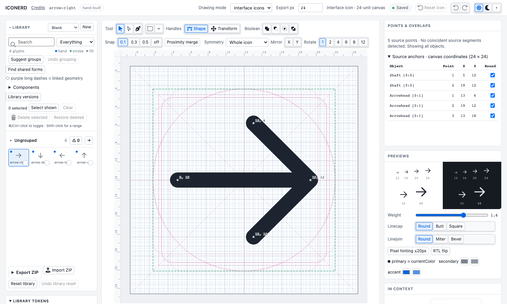
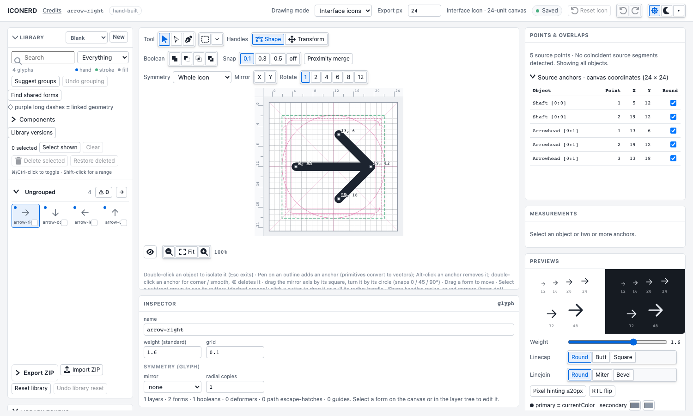
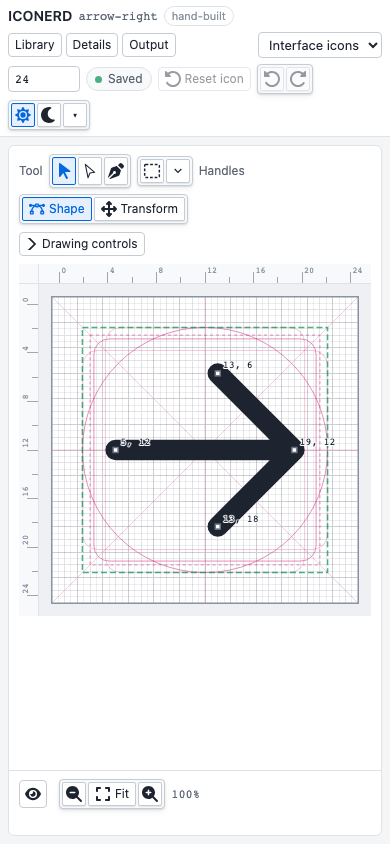

# Contained workspace and selection tools — adversarial self-review

Review scope: window containment, responsive panes, 12px disclosures, inferred anchor alignment, object/point measurements, pixel/snap distance edits, and live Fill/Stroke previews. This is self-review, not independent approval.

## Findings and repairs

- High: wrapping selected geometry in a synthetic compound altered semantics and crashed Paper.js when inspecting a mirrored Boolean subgroup. A one-child union preserves open/closed geometry without an extra crossing-resolution pass. The existing symmetry/cutter context-menu regression reproduces the failure and passes after repair.
- Medium: keyboard focus could move the clipped outer app despite overflow:hidden. Non-scroll outer containers now use overflow:clip and pane focus uses preventScroll. The physical pane-switch regression checks stationary canvas bounds. Compact drawers also clear their desktop grid-area assignment so absolute positioning uses the actual app region rather than a missing grid area.
- Medium: generic button styling overrode hidden desktop pane controls. Scoped button selectors now keep compact-only controls hidden on desktop; regression checks assert this.
- Medium: distance rounding could collapse a short selection to zero. Targets are positive multiples; a zero-distance selection cannot be resized, and snapping off disables snap rounding. First-to-last order and the geometry-changing action are stated in the Measurements UI.
- Low: arbitrary selected points do not define a path-length measurement unambiguously. The delivered distance is explicitly first-to-last straight-line distance in selection order; curved path-length editing is not claimed.

- Medium: selecting children must retain a parent’s implicit transform pivot computed from the complete parent, rather than recomputing it from each child. The measurement wrapper now supplies that original pivot explicitly; a two-child scale regression verifies spacing and overall dimensions.

## Verification boundaries

Alignment uses drawing-plane coordinates and least summed squared displacement, preserving local handle vectors. Distance resize maps world positions back through each object's invertible affine transform and scales selected handles with the range. Undo restores source geometry. Pixel spacing is 24 divided by configured export pixels; snap spacing remains independent. Visible object bounds are computed from baked rendered paths, including native stroke caps/joins and explicit rounded-tip paths. Cached bounds avoid repeating geometry evaluation for unchanged selection during navigation.

Responsive panes retain the mounted editor and artwork; no remount or schema migration is introduced. Existing import/reset/restore/component/selection gates remain required. Validation receipts and deployment identity are added after the final runs. Gradient studios and slash reconstruction are outside this change.

## Local receipt

Final production build passed. All 64 unit tests and all 95 production-browser tests passed; browser suite took 49.1 seconds. Physical tests include wheel pan, pane scroll containment, keyboard dismissal/focus return, multi-anchor edit/Undo, transformed dimensions, output-size pixel rounding and the former mirrored-group crash.

Before capture came from the previously deployed main build; after captures came from the final local production build. All screenshots use only public starter arrows in disposable browser contexts. They are not owner EDS artwork or owner-browser acceptance.
